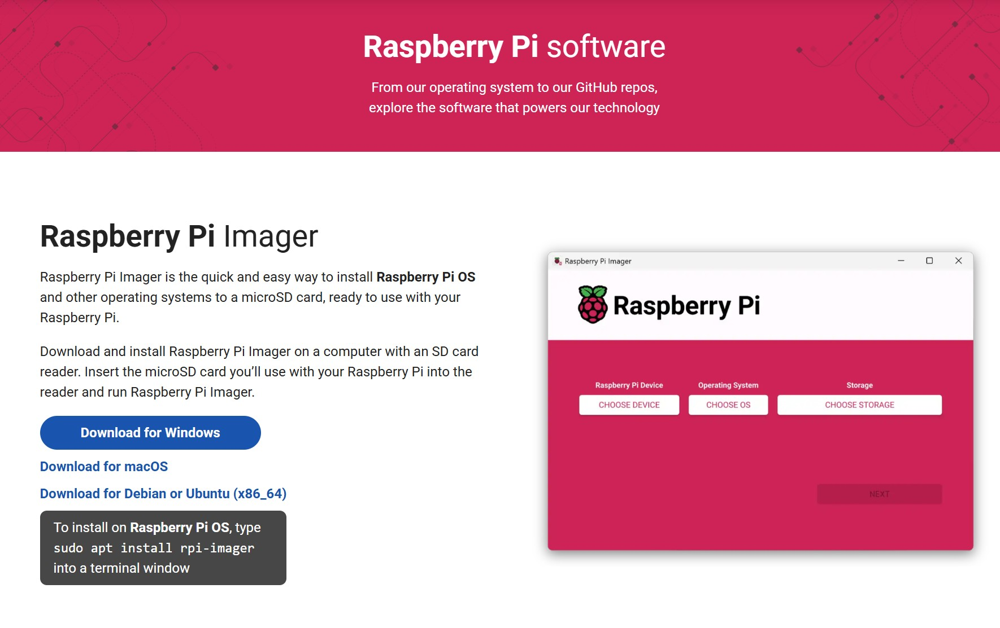
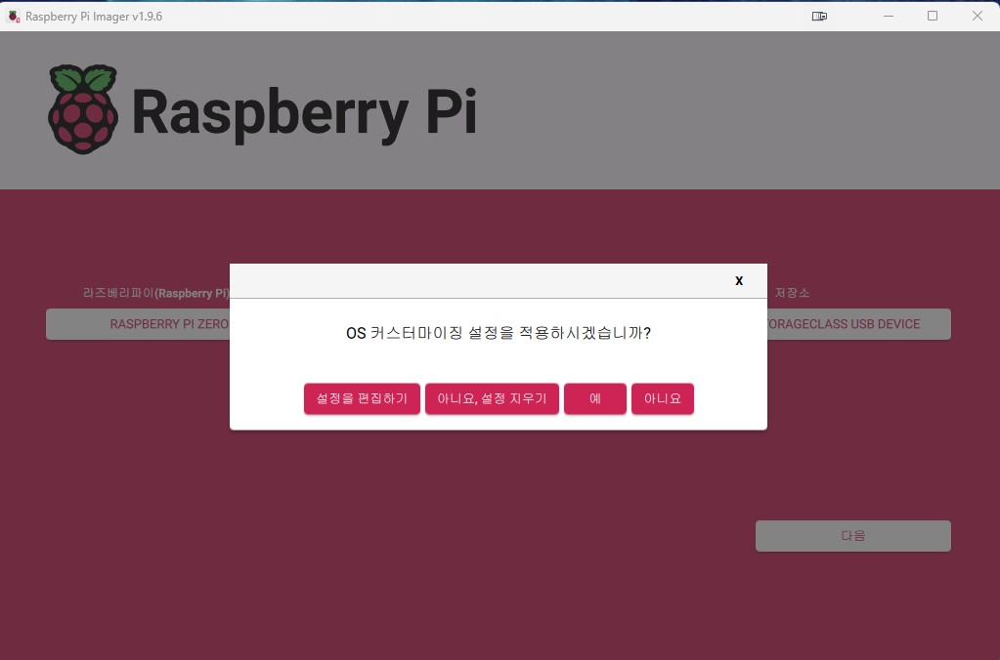
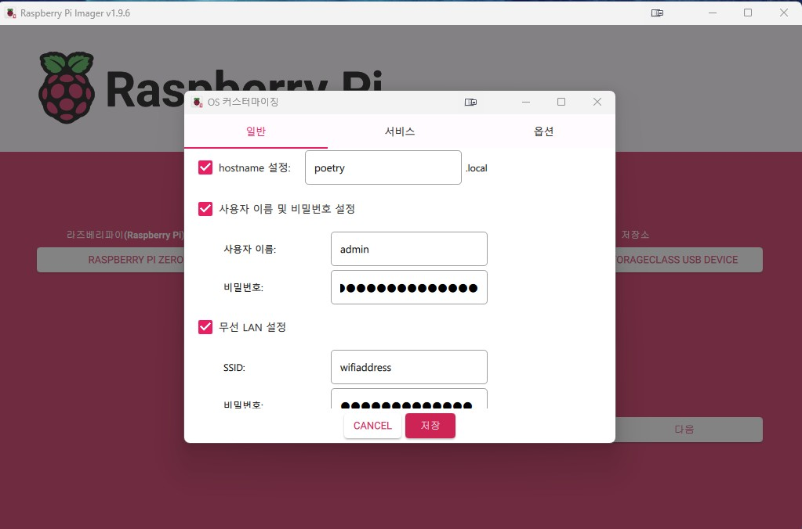
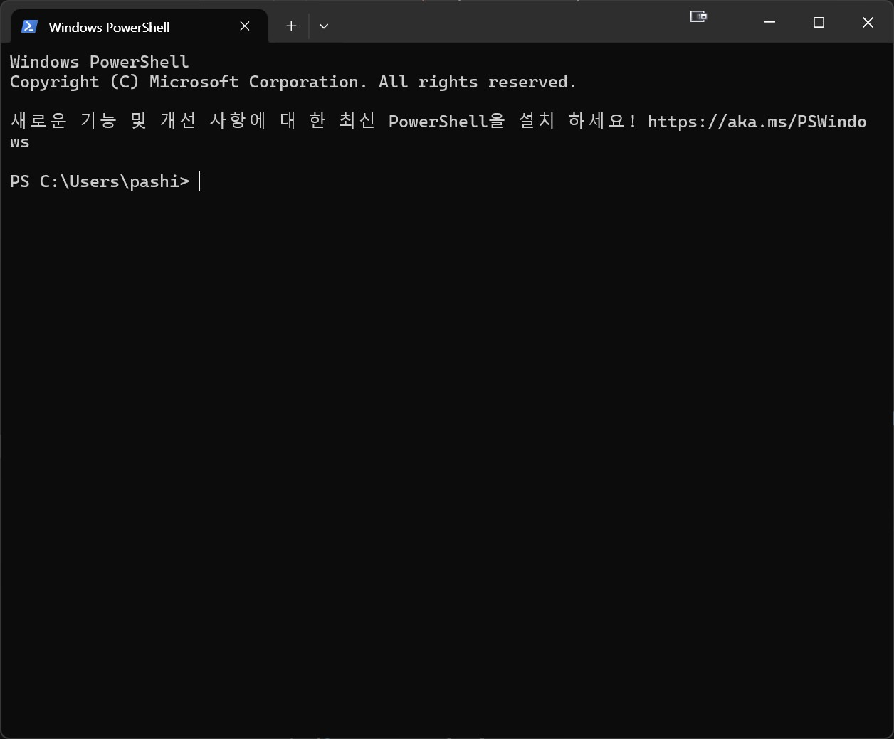

# Raspberry Pi Zero 2 W 소프트웨어 설정 가이드

이 문서는 Poetry Camera (시 카메라) 프로젝트를 위한 Raspberry Pi Zero 2 W의 소프트웨어 설치 및 구성 과정을 안내합니다.

이 가이드는 **헤드리스(headless) 설정**을 기준으로 작성되었습니다. 별도의 모니터, 키보드, 마우스 연결 없이 SSH를 통해 Raspberry Pi를 원격으로 설정하고 제어합니다.

**📌 사전 준비:**
- 하드웨어 구매 및 연결은 [README.md](README.md)를 먼저 참고하세요.
- 카메라 모듈과 프린터 하드웨어가 이미 연결되어 있어야 합니다.

## 목차
1. [Raspberry Pi OS 설치](#1-raspberry-pi-os-설치)
2. [SSH 접속 및 초기 설정](#2-ssh-접속-및-초기-설정)
3. [카메라 및 시리얼 포트 활성화](#3-카메라-및-시리얼-포트-활성화)
4. [프린터 드라이버 설치](#4-프린터-드라이버-설치)
5. [Poetry Camera 소프트웨어 설치](#5-poetry-camera-소프트웨어-설치)
6. [OpenAI API 설정](#6-openai-api-설정)
7. [테스트 및 검증](#7-테스트-및-검증)
8. [부팅 시 자동 실행 설정](#8-부팅-시-자동-실행-설정)
9. [Wi-Fi 네트워크 관리](#9-wi-fi-네트워크-관리)
10. [트러블슈팅](#트러블슈팅)

---

## 1. Raspberry Pi OS 설치

### 1.1 필요한 준비물
- **MicroSD 카드** (32GB 이상 권장)
- **MicroSD 카드 리더기** (PC/Mac에 연결용)
- **PC 또는 Mac** (OS 이미지 작성용)
### 1.2 Raspberry Pi Imager 다운로드
1. PC/Mac에서 [Raspberry Pi Imager](https://www.raspberrypi.com/software/)를 다운로드하고 설치합니다.



2. MicroSD 카드를 카드 리더기에 삽입하고 PC/Mac에 연결합니다.

### 1.3 OS 이미지 작성


1. **Raspberry Pi Imager**를 실행합니다.
2. **"CHOOSE DEVICE"** 클릭 → **Raspberry Pi Zero 2 W** 선택
3. **"CHOOSE OS"** 클릭 → **Raspberry Pi OS (64-bit)** 선택 (권장: Raspberry Pi OS Lite가 아닌 전체 버전)
4. **"CHOOSE STORAGE"** 클릭 → 연결된 MicroSD 카드 선택

### 1.4 고급 설정 (매우 중요!)



1. **"NEXT"** 클릭 후 **"EDIT SETTINGS"** 선택
2. **General 탭**에서 다음을 설정:
   - **Set hostname**: `poetry-camera` (또는 원하는 이름)
   - **Set username and password**: 
     - Username: `pi` (또는 원하는 이름)
     - Password: 안전한 비밀번호 설정
   - **Configure wireless LAN**: 
     - SSID: Wi-Fi 네트워크 이름
     - Password: Wi-Fi 비밀번호
     - Wireless LAN country: `KR` (한국)
   - **Set locale settings**:
     - Time zone: `Asia/Seoul`
     - Keyboard layout: `us` (또는 `kr`)

3. **Services 탭**에서:
   - **Enable SSH** 체크
   - **Use password authentication** 선택

4. **"SAVE"** 클릭

### 1.5 이미지 쓰기 및 부팅
1. **"YES"** 클릭하여 이미지 쓰기 시작
2. 쓰기 완료 후 MicroSD 카드를 안전하게 제거합니다.
3. MicroSD 카드를 Raspberry Pi Zero 2 W에 삽입합니다.
4. 전원 어댑터를 연결하여 Pi를 부팅합니다.
5. **Pi가 부팅되고 OS 이미지가 설치될 때까지 1-2분간 대기합니다.** (녹색 LED가 깜빡이면 정상 작동 중)

---

## 2. SSH 접속 및 초기 설정

### 2.1 Windows에서 터미널 실행하기
SSH로 Raspberry Pi에 접속하려면 먼저 Windows 터미널을 실행해야 합니다.



1. `Win` 키를 누르거나 시작 메뉴 클릭
2. "PowerShell" 또는 "터미널" 입력
3. **Windows PowerShell** 또는 **Terminal** 선택


### 2.2 SSH로 Raspberry Pi 접속
터미널이 실행되면 다음 명령어로 Raspberry Pi에 접속합니다:

```powershell
# hostname으로 접속 (권장)
ssh pi@poetry-camera.local
```

> **명령어 설명**: `ssh [username]@[hostname].local` 형식입니다.
> - `pi`: 2.3 단계에서 설정한 **사용자 이름 (username)**
> - `poetry-camera`: 2.3 단계에서 설정한 **호스트 이름 (hostname)**
> - 다른 이름으로 설정했다면 해당 이름으로 변경하세요.

만약 `.local` 주소로 접속이 안 되면, 라우터 관리 페이지에서 Pi의 IP 주소를 확인한 후:
```powershell
# IP 주소로 접속 (예시)
ssh pi@192.168.0.100
```

> **참고**: 
> - 위 명령어의 `pi`는 2.3 단계에서 Raspberry Pi Imager의 고급 설정에서 설정했던 사용자 이름입니다. 
> - `poetry-camera`는 2.3 단계에서 설정한 hostname입니다.
> - 다른 이름으로 설정했다면 해당 이름으로 변경하세요.

**첫 접속 시 나타나는 메시지:**
```
The authenticity of host 'poetry-camera.local (192.168.x.x)' can't be established.
...
Are you sure you want to continue connecting (yes/no/[fingerprint])?
```
→ `yes` 입력 후 Enter

**비밀번호 입력:**
- 2.3 단계에서 설정한 비밀번호를 입력합니다.
- 입력 중에는 화면에 아무것도 표시되지 않지만 정상입니다.
- 입력 완료 후 Enter

접속에 성공하면 다음과 같은 화면이 나타납니다:
```
pi@poetry-camera:~ $
```

### 2.3 시스템 업데이트
SSH 접속 후 다음 명령을 실행합니다:

```bash
sudo apt-get update
sudo apt-get upgrade -y
```

### 2.7 Raspberry Pi 구성 설정
Raspberry Pi 하드웨어 설정을 변경합니다:

```bash
sudo raspi-config
```

다음 설정을 변경하세요:
- **카메라 설정**: 최신 Raspberry Pi OS에서는 카메라 옵션이 기본적으로 없으며, libcamera가 자동으로 활성화되어 있습니다.
- **Interface Options → Serial Port** 선택:
  - "Would you like a login shell to be accessible over serial?" → **No** 선택
  - "Would you like the serial port hardware to be enabled?" → **Yes** 선택
  - Finish로 빠져나옵니다.

설정 변경 후 재부팅이 필요합니다. raspi-config 종료 시 자동으로 재부팅 여부를 물어보므로, **Yes**를 선택하면 별도로 재부팅 명령을 실행할 필요가 없습니다.
```bash
sudo reboot  # 자동 재부팅을 선택하지 않은 경우에만 실행
```

재부팅 후 다시 SSH로 접속합니다.

### 3.2 카메라 테스트
```bash
# 카메라가 인식되는지 확인
libcamera-hello

# 테스트 사진 촬영
libcamera-jpeg -o test.jpg
```

정상적으로 작동하면 `test.jpg` 파일이 생성됩니다.

---

## 4. 프린터 드라이버 설치

### 4.1 Adafruit Thermal Printer 드라이버 설치
```bash
cd ~
git clone https://github.com/adafruit/zj-58
cd zj-58
make
sudo ./install
```

### 4.3 프린터 하드웨어 연결
열전사 프린터를 Raspberry Pi에 연결합니다:

| 프린터 핀 | Pi GPIO 핀 |
|---------|-----------|
| GND     | GND       |
| RX      | TX (GPIO 14) |
| TX      | RX (GPIO 15) |

**전원 연결**:
- 프린터의 DC 전원 커넥터에 5V 전원 어댑터를 연결합니다.
- 프린터와 Pi는 **별도의 전원**을 사용해야 합니다.

### 4.4 프린터 보드레이트 확인
프린터의 보드레이트를 확인하세요 (일반적으로 `19200` 또는 `9600`).
이 값은 나중에 코드에서 사용됩니다.

**참고:** 프린터 하드웨어 연결 방법은 [README.md](README.md)의 "하드웨어 조립 가이드"를 참고하세요.

---

## 5. Poetry Camera 소프트웨어 설치

### 5.1 저장소 클론
```bash
cd ~
git clone https://github.com/carolynz/poetry-camera-rpi.git
cd poetry-camera-rpi
```

### 5.2 Python 패키지 설치
```bash
pip3 install -r requirements.txt
```

주요 패키지:
- `picamera2`: 카메라 제어
- `openai`: OpenAI API 사용
- `python-dotenv`: 환경 변수 관리
- `Adafruit-Thermal`: 프린터 제어

### 5.3 프린터 보드레이트 설정
프린터의 보드레이트가 `19200`과 다르다면, `main.py` 파일을 수정합니다:

```python
# main.py에서 해당 라인을 찾아 보드레이트를 변경
printer = Adafruit_Thermal('/dev/serial0', 19200, timeout=5)  # 19200을 실제 값으로 변경
```

---

## 6. OpenAI API 설정

### 6.1 OpenAI API 키 발급
1. [OpenAI 웹사이트](https://openai.com/)에서 계정을 생성합니다.
2. API 키를 발급받습니다.

### 6.2 .env 파일 생성
```bash
cd ~/poetry-camera-rpi
nano .env
```

다음 내용을 추가합니다:
```
OPENAI_API_KEY=your_actual_api_key_here
```

저장하고 종료: `Ctrl+X`, `Y`, `Enter`

---

## 7. 테스트 및 검증

### 7.1 수동 테스트
먼저 스크립트가 정상적으로 작동하는지 확인합니다:

```bash
cd ~/poetry-camera-rpi
python3 main.py
```

셔터 버튼의 LED가 켜지고, 버튼을 누르면 사진을 찍고 시를 출력하는지 확인합니다.

**문제가 발생하면:**
- 카메라 연결 상태 확인
- 프린터 전원 및 연결 확인
- OpenAI API 키가 올바르게 설정되었는지 확인
- 인터넷 연결 확인

---

## 8. 부팅 시 자동 실행 설정

### 8.1 Cron 작업 설정
Cron 작업을 설정하여 부팅 시 자동으로 스크립트를 실행하도록 합니다:

```bash
crontab -e
```

편집기가 열리면 다음 줄을 맨 아래에 추가합니다:
```
@reboot python3 /home/pi/poetry-camera-rpi/main.py >> /home/pi/poetry-camera-rpi/errors.txt 2>&1
```

**설명**:
- `@reboot`: 부팅 시 실행
- `>> .../errors.txt 2>&1`: 오류 메시지를 파일로 저장 (디버깅용)

저장하고 종료한 후 재부팅하여 테스트합니다:
```bash
sudo reboot
```

### 8.2 자동 실행 확인
재부팅 후:
1. LED가 켜질 때까지 기다립니다 (준비 완료 신호)
2. 셔터 버튼을 눌러 정상 작동하는지 확인합니다
3. 문제가 있다면 `errors.txt` 파일을 확인합니다:
   ```bash
   cat ~/poetry-camera-rpi/errors.txt
   ```

---

## 9. Wi-Fi 네트워크 관리

### 9.1 단일 Wi-Fi 네트워크 설정
기본 Wi-Fi 네트워크를 설정합니다:

```bash
sudo raspi-config
```
- **System Options → Wireless LAN**에서 SSID와 비밀번호를 입력합니다.

### 9.2 여러 Wi-Fi 네트워크 설정
`wpa_supplicant.conf` 파일을 편집하여 여러 네트워크를 추가할 수 있습니다:

```bash
sudo nano /etc/wpa_supplicant/wpa_supplicant.conf
```

다음 형식으로 네트워크를 추가합니다:
```
network={
    ssid="WiFi_이름_1"
    psk="비밀번호_1"
    priority=1
}

network={
    ssid="WiFi_이름_2"
    psk="비밀번호_2"
    priority=2
}
```
`priority` 값이 높을수록 우선순위가 높습니다.

### 9.3 이동 중 Wi-Fi 변경 (고급)
외부에서 쉽게 Wi-Fi를 변경하려면 [Raspberry Pi 공식 호텔 Wi-Fi 튜토리얼](https://www.raspberrypi.com/tutorials/host-a-hotel-wifi-hotspot/)을 참고하세요.

**추가로 필요한 하드웨어**:
- USB Wi-Fi 어댑터 (Raspberry Pi와 호환되는 제품)
- MicroUSB→USB 어댑터

**작동이 확인된 Wi-Fi 어댑터**:
- [LOTEKOO, Amazon](https://www.amazon.com/dp/B06Y2HKT75)
- [Canakit, Amazon](https://www.amazon.com/dp/B00GFAN498)

더 자세한 내용은 [README.md](README.md)의 "추가 기능" 섹션을 참고하세요.

---

## 트러블슈팅

### 카메라가 인식되지 않음
```bash
# 카메라 감지 확인
vcgencmd get_camera

# 출력이 "supported=1 detected=1"이어야 함
```

### 프린터가 응답하지 않음
1. 프린터 전원이 켜져 있는지 확인
2. 배선이 올바른지 확인 (TX↔RX 교차 연결)
3. 보드레이트가 일치하는지 확인
4. 시리얼 포트 활성화 확인: `sudo raspi-config`

### OpenAI API 오류
1. API 키가 올바른지 확인
2. `.env` 파일 위치 확인
3. 인터넷 연결 확인
4. OpenAI 계정 크레딧 잔액 확인

### 부팅 시 자동 실행 안 됨
1. `errors.txt` 파일 확인
2. 경로가 절대 경로인지 확인
3. 사용자명이 `pi`가 아니라면 경로 수정 필요
4. Python 스크립트에 실행 권한 확인:
   ```bash
   chmod +x ~/poetry-camera-rpi/main.py
   ```

### 전원 문제
- Pi가 자주 재부팅됨: 전원 공급이 부족 (최소 5V 1.2A 필요)
- 프린터 인쇄 중 Pi 종료: 프린터와 Pi를 별도 전원으로 사용
- 저전압 경고: 더 강력한 전원 어댑터 사용

---

## 다음 단계

소프트웨어 설정이 완료되었다면, [README.md](README.md)로 돌아가 다음 단계를 진행하세요:
- 전원 회로 최적화
- 케이스 제작 및 최종 조립
- 추가 기능 설정

---

## 참고 자료
- [Raspberry Pi 공식 문서](https://www.raspberrypi.com/documentation/)
- [Adafruit Thermal Printer 가이드](https://learn.adafruit.com/networked-thermal-printer-using-cups-and-raspberry-pi)
- [libcamera 문서](https://www.raspberrypi.com/documentation/computers/camera_software.html)
