# Poetry Camera (시 카메라)
보는 것을 시로 출력하는 카메라입니다.

이 가이드는 [원본 프로젝트](https://github.com/bokito-studio/poetry-camera-rpi)를 참조하여 한국 환경에 맞게 설치 과정을 변형했습니다. 부품 구매는 알리익스프레스를 기준으로 작성되었으나, 국내 쇼핑몰(네이버 스마트스토어, 쿠팡 등)에서도 대부분 구매 가능합니다.

⚠️ 이 지침은 아직 작성 중입니다. ⚠️  시도해보시고 혼란스럽거나 작동하지 않는 부분이 있으면 알려주세요.

## 필요한 하드웨어
### 1. 컴퓨터: 헤더가 포함된 [Raspberry Pi Zero 2 W](https://www.raspberrypi.com/products/raspberry-pi-zero-2-w/)

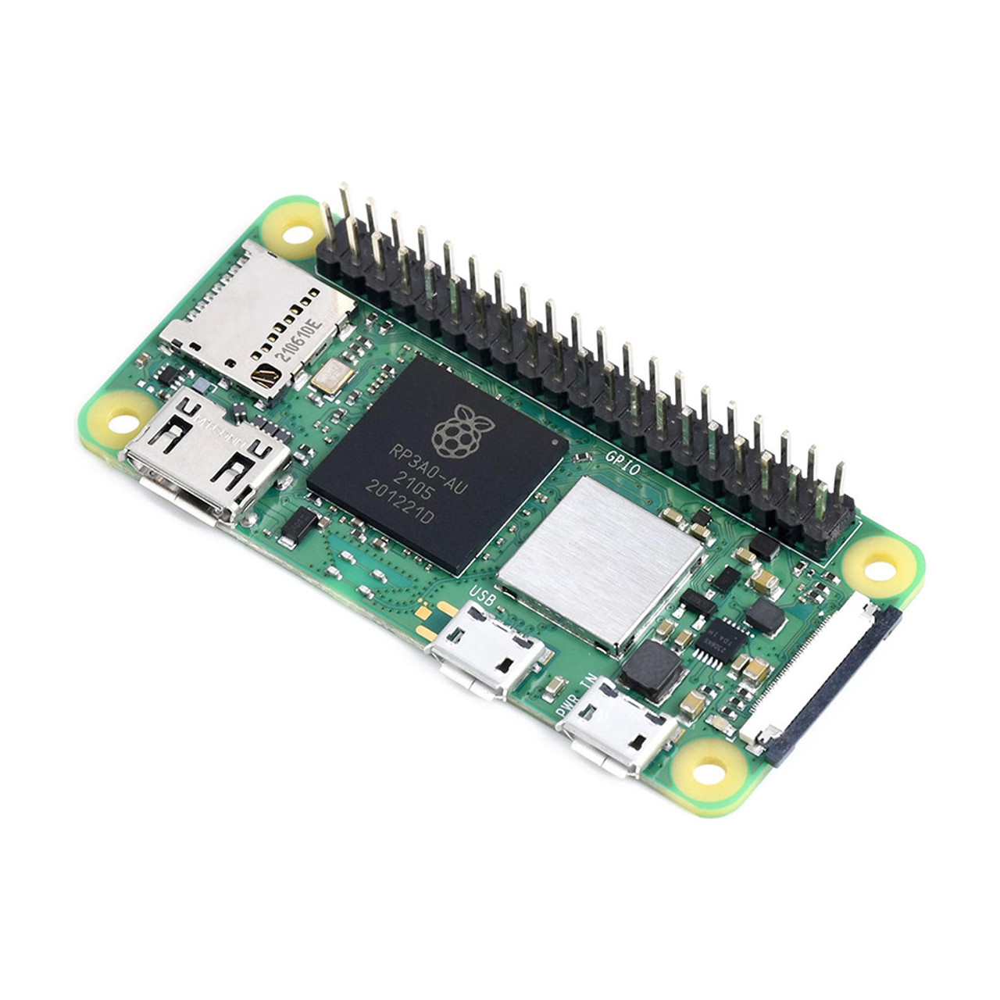

Raspberry Pi는 단순화된 컴퓨터입니다. 가볍고 저렴하지만 처리 성능이 제한적이며, 일반 소비자 전자제품보다 더 취약합니다. 전원 공급에 매우 민감해서 전압이 너무 높으면 부품이 손상되고, 너무 낮으면 소프트웨어가 실행되지 않습니다. 또한 전원을 빼기 전에 소프트웨어를 수동으로 종료해야 파일 시스템/소프트웨어 손상을 방지할 수 있습니다.

원본 프로젝트에서는 처리 성능과 크기의 균형을 고려하여 [Raspberry Pi Zero 2 W](https://www.raspberrypi.com/products/raspberry-pi-zero-2-w/) 또는 [Pi 3B+](https://www.raspberrypi.com/products/raspberry-pi-3-model-b-plus/)를 권장합니다. Pi Zero는 처리 속도가 너무 느리고, [Pi 4](https://www.raspberrypi.com/products/raspberry-pi-4-model-b/)는 요구 전력이 커서 휴대용으로 쓰기에는 비현실적일 수 있습니다. 이 가이드에서는 Pi Zero 2 W를 기준으로 설명합니다.

Raspberry Pi Zero 2는 종종 헤더(2x20 검은 금속 커넥터) 없이 판매됩니다. 헤더가 있으면 점퍼 와이어로 프린터와 버튼을 쉽게 연결할 수 있습니다. 

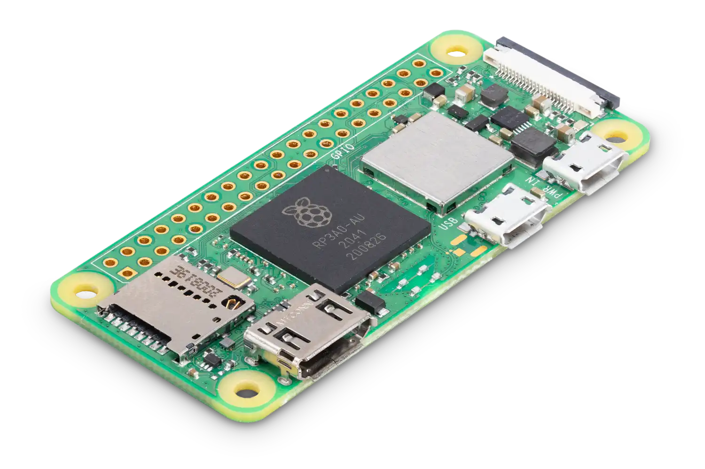


### 2. Accessories to connect the Raspberry Pi to stuff.
  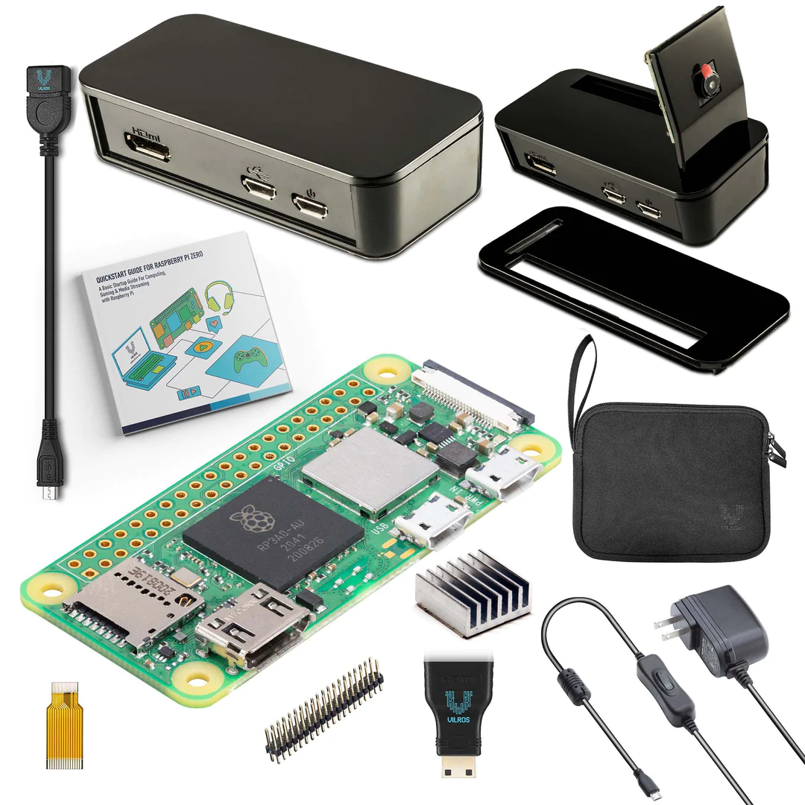
  
    
### 3. Camera: [Raspberry Pi Camera Module 3](https://www.raspberrypi.com/products/camera-module-3/)
  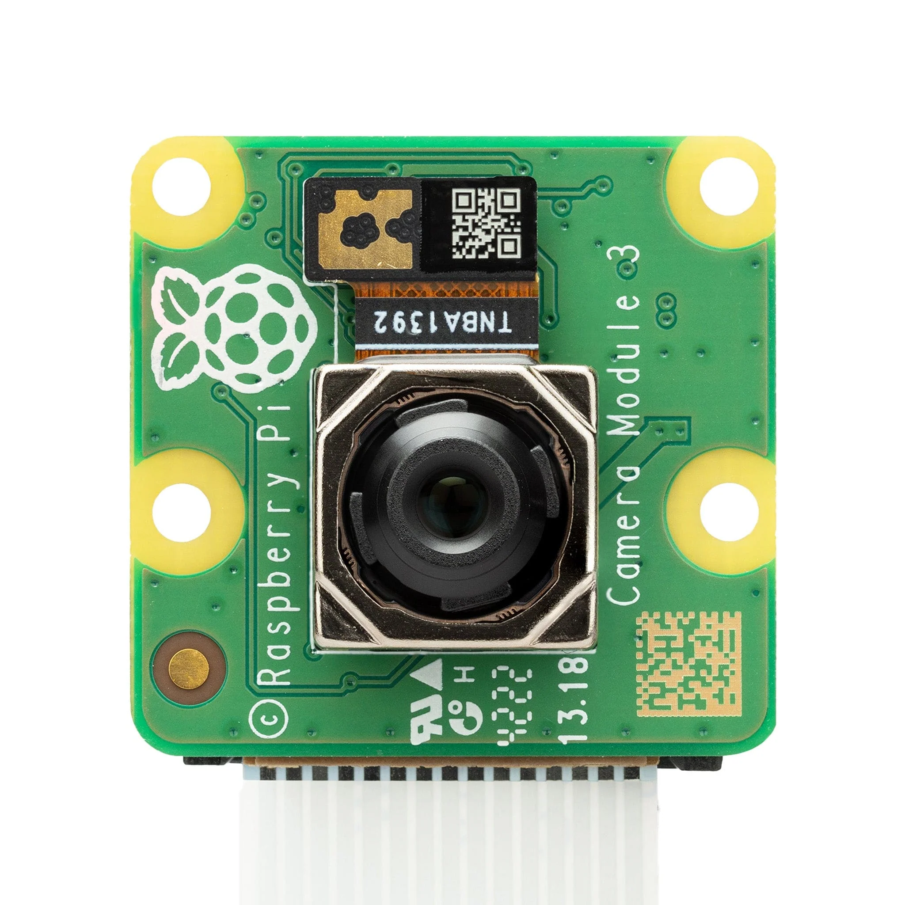

  대체로 간단하지만, 하드웨어 손상에 주의하세요. Raspberry Pi 카메라는 섬세하고 정전기에 의해 쉽게 망가질 수 있습니다. 

  라즈베리 파이 카메라는 몇 가지 종류가 있으며, 이 가이드에서는 정품 Raspberry Pi Camera Module 3를 기준으로 작성되었습니다. 호환 카메라 모듈도 사용 가능하지만, 드라이버나 설정이 다를 수 있습니다.

  - **카메라 액세서리:**
    - **카메라 케이블**: 라즈베리 파이 모델에 따라 필요한 케이블이 다릅니다.
      
      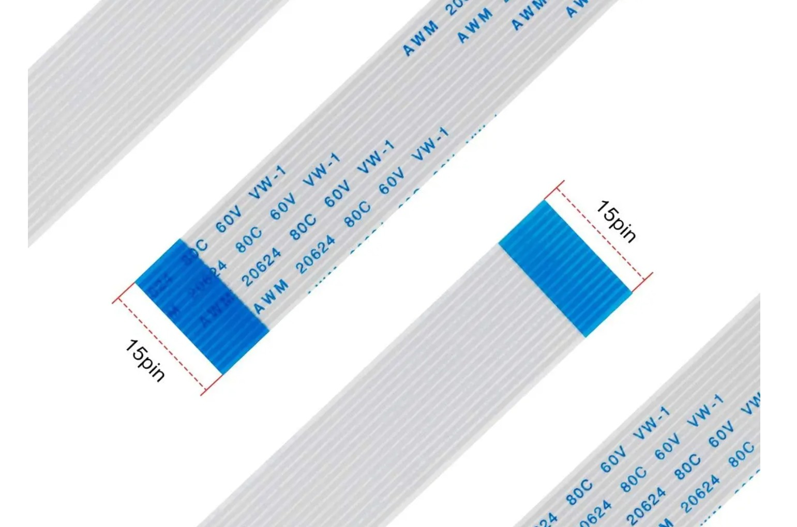
      
      위 이미지는 Raspberry Pi 3B+ 등 일반 Pi용 케이블로, 양쪽 커넥터의 폭이 동일합니다.
      
      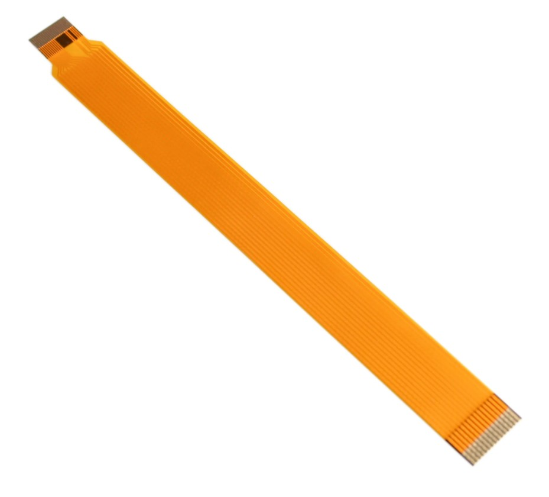
      
      위 이미지는 Raspberry Pi Zero/Zero 2 W 전용 케이블로, 양쪽 커넥터의 폭이 다릅니다 (한쪽은 좁고 한쪽은 넓음). 
      
      ⚠️ **주의**: 케이블 구매 시 반드시 사용하는 라즈베리 파이 모델에 맞는 케이블을 선택하세요!


### 4. Receipt printer: [Mini Thermal Printer w/ TTL Serial connection](https://www.adafruit.com/product/2752)

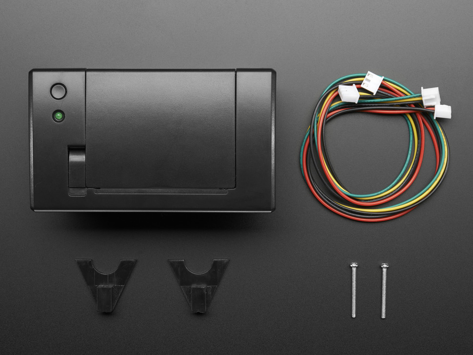

이 프로젝트에는 Adafruit의 열전사 프린터 라인을 사용했지만, 현재는 단종되었습니다. 아마존/알리익스프레스에서 유사 제품을 찾을 수 있으며, 우리가 구매한 제품들은 [동일한 프린터 드라이버](https://github.com/adafruit/zj-58)로 동작했습니다(Adafruit 측 유지보수는 중단되었지만 여전히 동작하는 것으로 보임).

[Nano Thermal Printer](https://www.adafruit.com/product/2752) 또는 [Tiny Thermal Printer](https://www.adafruit.com/product/2751)가 더 컴팩트하지만, [배선이 약간 다릅니다](https://learn.adafruit.com/mini-thermal-receipt-printer/making-connections#for-product-number-2751-tiny-3133460).

중요한 점은 프린터가 TTL 직렬(Serial) 연결을 지원해야 Pi에 쉽게 연결할 수 있다는 것입니다. 아마존이나 알리익스프레스에서 부품을 찾을 때는 **"TTL embedded thermal printer"**로 검색해 보세요.

  - **아마존의 유사 영수증 프린터:**
    - [Adafruit Mini 프린터 대체품](https://www.amazon.com/HUIOP-Embedded-Printing-Commands-Apparatus/dp/B0CS3NRPV3)
    - [Adafruit Tiny 프린터 대체품](https://www.amazon.com/XIXIAN-Thermal-Embedded-Interface-Printing/dp/B0C5XGJWC4)

  - **영수증 프린터 액세서리:**
    - [5V 전원 어댑터](https://www.adafruit.com/product/276)
    - 프린터와 전원 공급을 연결하기 위한 [DC 전원 암 커넥터](https://www.adafruit.com/product/368)
    - 배선용 니퍼/와이어 스트리퍼/소형 드라이버
    - 영수증 용지: [EcoChit 열전사용지, 2.25"](https://www.amazon.com/EcoChit-Thermal-Paper-Rolls-Plants/dp/B076MMDL8Y) (페놀 무함유, 재활용 가능)
        - 일반 영수증 용지는 사용하지 마세요! [BPA가 함유된 경우가 많습니다](https://environmentaldefence.ca/2019/02/07/toxic-receipt-bpa-thermal-paper/). 특히 아동과 생식 건강에 매우 해롭습니다.


### 5. Batteries:
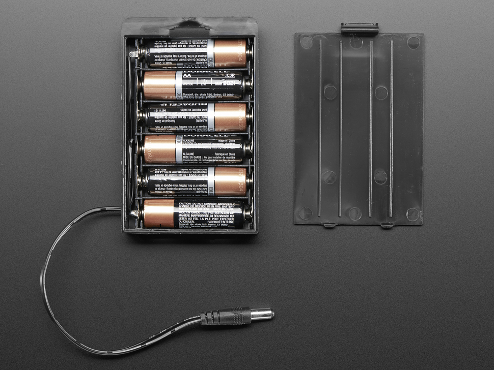
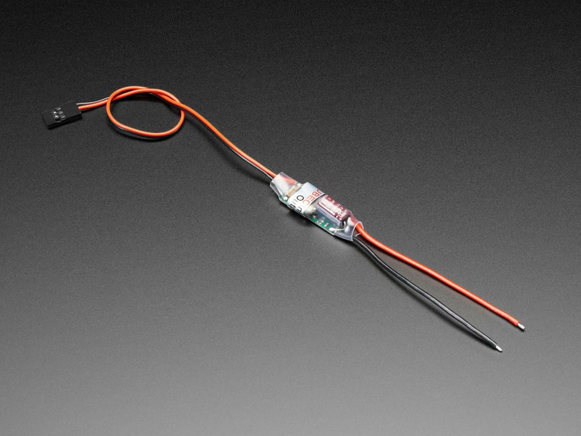
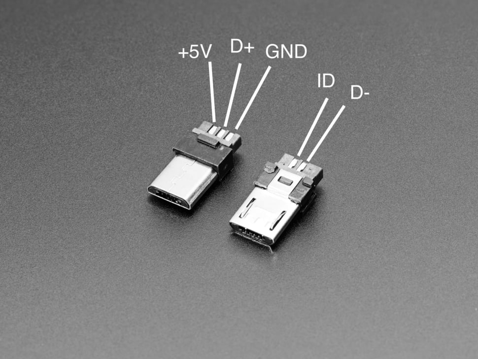

카메라를 휴대용으로 쓰고 싶다면 배터리가 필요합니다! Pi는 5V 1.2A의 안정적인 전원이 필요하고, 프린터는 5~9V를 요구하며 인쇄 중에는 약 2A를 소모합니다.

**권장 전원: AA 배터리 6개(6xAA)**

가장 가벼운 방법은 아니지만, 초보자에게 적합한 출발점입니다.
  - [DC 플러그가 달린 6 x AA 배터리 홀더](https://www.adafruit.com/product/248)
  - AA 배터리 6개 — 충전식 NiMH(예: 에네루프)는 7.2V, 일회용 알카라인(예: 듀라셀)은 9V를 제공합니다. 둘 다 사용 가능. 단, 서로 다른 종류를 섞지 마세요!
  - 회로 전원 제어용 [인라인 DC 배럴 잭 스위치](https://www.adafruit.com/product/1125)
  - 배터리를 회로에 연결할 [DC 와이어 터미널 블록](https://www.adafruit.com/product/368)
  - [스텝다운(벅) 컨버터 — 5V 3A 출력](https://www.adafruit.com/product/1385): 배터리 전압을 Raspberry Pi용 5V로 강하
  - Pi 전원 공급용 [MicroUSB 셸](https://www.adafruit.com/product/1826) 또는 MicroUSB 케이블 절개 사용
  - 납땜 인두

**다른 가능한 해법:**
  - 위 회로를 PCB로 만들어 납땜 대신 커넥터만 꽂도록 하기 — 우리는 실제로 그렇게 사용했습니다! 향후 거버 파일을 업로드할 예정입니다.
  - 7.2V 리튬 배터리(예: 18650 x 2)
  - [RC 카용 7.2V NiMH 배터리](https://www.amazon.com/s?k=7.2v+rc+battery&i=toys-and-games&crid=1FRMK7CHC0RRQ&sprefix=7.2v+rc+battery,toys-and-games,127)
  - 초경량 휴대성이 필요 없다면, Pi와 프린터를 꽂아 쓰는 [포터블 파워 스테이션](https://www.amazon.com/gp/product/B0CH2Z2JM9)도 방법
  - 납땜을 원치 않는다면 Pi와 프린터를 각각 다른 배터리로 구동하는 방법도 있습니다. 다만 흔히 추천되는 [PiSugar 3 배터리](https://www.tindie.com/products/pisugar/pisugar-3-battery-for-raspberry-pi-zero/)는 과열 문제가 있었습니다.
    
**작동하지 않는 전원 솔루션:**
  - 일반적인 9V 알카라인 배터리는 필요한 전류를 공급하지 못해 동작하지 않습니다
  - 일반 보조배터리(폰 보조 전원)는 Raspberry Pi에 연속 전원을 공급하지 못해 수분 내 자동 종료될 수 있습니다
  - 단일 5V 보조배터리에 Pi와 프린터를 함께 꽂기 — 인쇄 시 전류 요구치를 감당하지 못합니다. 인쇄 도중 Pi가 꺼지거나 프린터 출력이 부족해 인쇄가 실패합니다.


### 6. Shutter button & LED
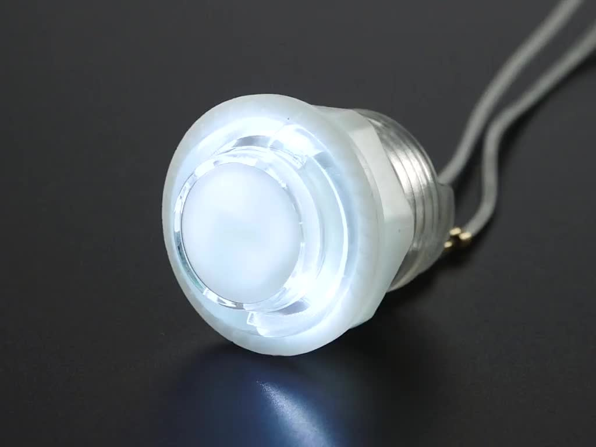

셔터 버튼은 임시(momentary) 푸시버튼이면 아무거나 사용 가능합니다. LED는 준비 완료, 로딩 등 상태 표시용으로 사용합니다.

  - [LED가 내장된 푸시버튼](https://www.adafruit.com/search?q=16mm%20Panel%20Mount%20Momentary%20Pushbutton): 촉감(클릭감)은 애매하지만, LED 내에 저항이 포함되어 있어 편리합니다.
  - 버튼을 Pi에 쉽게 연결하기 위한 [퀵 커넥트 와이어 2개](https://www.adafruit.com/product/1152)

### 7. Miscellaneous equipment
  - 니퍼 & 와이어 스트리퍼
  - 납땜 인두 및 소모품
  - 점퍼 케이블

## 소프트웨어
현재 코드는 OpenAI 모델을 사용해 사진을 시로 변환합니다. 또한 [Adafruit의 Thermal Printer 파이썬 라이브러리](https://github.com/adafruit/Python-Thermal-Printer)의 드라이버를 사용합니다.

[OpenAI 계정 및 API 키](https://openai.com/index/openai-api)는 직접 발급받아야 합니다. 요청 한 번에 몇 센트 수준의 비용이 듭니다.

현재 Pi에서 실행되는 `main.py` 스크립트는 다음을 수행합니다:
- 셔터 버튼을 누르면 사진을 촬영합니다
- 촬영한 사진을 GPT-4 Vision으로 보내 캡션을 생성합니다
- 캡션을 받으면, 그 캡션을 바탕으로 GPT-4에 시를 만들어 달라고 요청합니다
- 생성된 시를 열전사(영수증) 프린터로 출력합니다


# 모두 연결하기
다음 튜토리얼을 참고해 구성했습니다:
- [Raspberry Pi와 열전사 프린터로 즉석 카메라 만들기](https://learn.adafruit.com/instant-camera-using-raspberry-pi-and-thermal-printer)
- [Raspberry Pi와 CUPS로 네트워크 열전사 프린터 구성](https://learn.adafruit.com/networked-thermal-printer-using-cups-and-raspberry-pi)

### Part 1. Raspberry Pi와 카메라가 작동하는지 확인
1. Raspberry Pi에 카메라 모듈을 연결합니다.

2. 새로 설치한 Raspberry Pi OS가 들어 있는 SD 카드를 Pi에 삽입합니다.

3. Mini HDMI 케이블로 Pi를 모니터에 연결합니다.

5. 전원을 연결합니다. Pi의 녹색 LED가 켜지고 모니터에 시작 화면이 보여야 합니다.
  
7. 부팅이 완료되면 Pi에서 터미널을 열어 설정을 진행합니다.

8. 카메라/직렬 입력을 사용하도록 Raspberry Pi 하드웨어를 설정합니다:
```shell
sudo raspi-config
```

9. 다음 설정을 변경하세요:
  - Glamor: ON (최신 Raspbian OS에서 카메라 설정용)
  - Serial Port: ON (영수증 프린터 입력 사용)
  - Serial Console: OFF (정확한 용도는 모르지만 비활성화 필요)

  필요하다면 시스템을 재부팅하세요.

[튜토리얼 TODO: 기본 카메라 테스트 스크립트 및 기대 동작 추가]

### Part 2. 프린터가 작동하는지 확인
1. 시스템을 업데이트하고 필요한 패키지를 설치합니다. 모두 필요한지는 확실치 않으니, 나중에 다시 점검해 불필요한 항목은 정리할 예정입니다.
```shell
$ sudo apt-get update
$ sudo apt-get install git cups build-essential libcups2-dev libcupsimage2-dev python3-serial python-pil python-unidecode
```

2. Adafruit Thermal Printer가 동작하는 데 필요한 소프트웨어를 설치합니다.
```shell
$ cd
$ git clone https://github.com/adafruit/zj-58
$ cd zj-58
$ make
$ sudo ./install
```

3. 시 카메라(소프트웨어)가 들어 있는 이 저장소를 클론합니다:
```shell
$ cd
$ git clone https://github.com/carolynz/poetry-camera-rpi.git
```

4. 열전사 프린터에 전원을 연결하고 Pi에 연결합니다. [이 튜토리얼의 도식과 설명을 참고하세요.](https://learn.adafruit.com/networked-thermal-printer-using-cups-and-raspberry-pi/connect-and-configure-printer)
  정상 동작하는지 테스트하세요. 프린터의 보드레이트(예: `19200`)를 반드시 확인하세요. 이 값은 이후에 사용합니다.

5. `poetry-camera-rpi` 디렉터리로 이동:
```shell
$ cd poetry-camera-rpi
```

6. 프린터의 보드레이트가 `19200`과 다르다면 `main.py`를 열어 해당 숫자를 프린터의 보드레이트로 변경합니다:
```shell
# main.py:

# instantiate printer
printer = Adafruit_Thermal('/dev/serial0', 19200, timeout=5)
```

[TODO] 프린터 작동 여부를 테스트하는 셋업 스크립트 추가

### Part 3. AI 설정
1. OpenAI 계정을 만들고 API 키를 발급받습니다.

2. 시 카메라 코드가 있는 디렉터리에서 `.env` 파일을 생성합니다. 이 파일에 OpenAI API 키처럼 민감한 정보를 저장합니다:
```nano .env```

3. `.env` 파일에 API 키를 추가합니다:
```OPENAI_API_KEY=pasteyourAPIkeyhere```

[TODO] OpenAI 테스트 스크립트 추가


### Part 4. 끝까지 연결해 동작 확인
[TODO] 배선도 추가

1. 버튼을 연결합니다

2. 시 카메라 스크립트를 실행합니다.
```shell
$ python main.py
```

3. 셔터 버튼의 LED가 켜져 사진 촬영 준비 완료 상태인지 확인합니다

4. 셔터 버튼을 눌러 시가 인쇄될 때까지 기다립니다.

[TODO] 자주 발생하는 오류 메시지 및 트러블슈팅 추가

## Part 5. 전원이 켜지면 시 카메라 코드 자동 실행

1. 부팅 시 파이썬 스크립트를 실행하도록 `cron` 작업을 설정합니다. 먼저 기본 편집기로 `crontab`을 엽니다:
```shell
$ crontab -e
```

2. 컴퓨터가 부팅될 때 스크립트를 실행하도록, `crontab`에 다음 줄을 추가합니다.
```shell
# Run poetry camera script at start
@reboot python /home/pi/poetry-camera-rpi/main.py >> /home/pi/poetry-camera-rpi/errors.txt 2>&1
```
명령의 `>> {...}errors.txt 2>&1` 부분은 오류 메시지를 `errors.txt`로 리디렉션하여 디버깅에 도움을 줍니다. 흔한 실패 원인은 파일을 찾을 수 없다는 문제입니다. 모든 파일 경로가 절대 경로인지, 사용자명/디렉터리명이 올바른지 확인하세요.

- 변경 사항을 적용하려면 시스템을 재부팅합니다
```shell
sudo reboot
```
이제 카메라를 재부팅하고 LED가 켜질 때까지 기다리세요!


## Part 6. 전원 회로 만들기
[TODO] 정리 및 단계별 설명 추가 :)

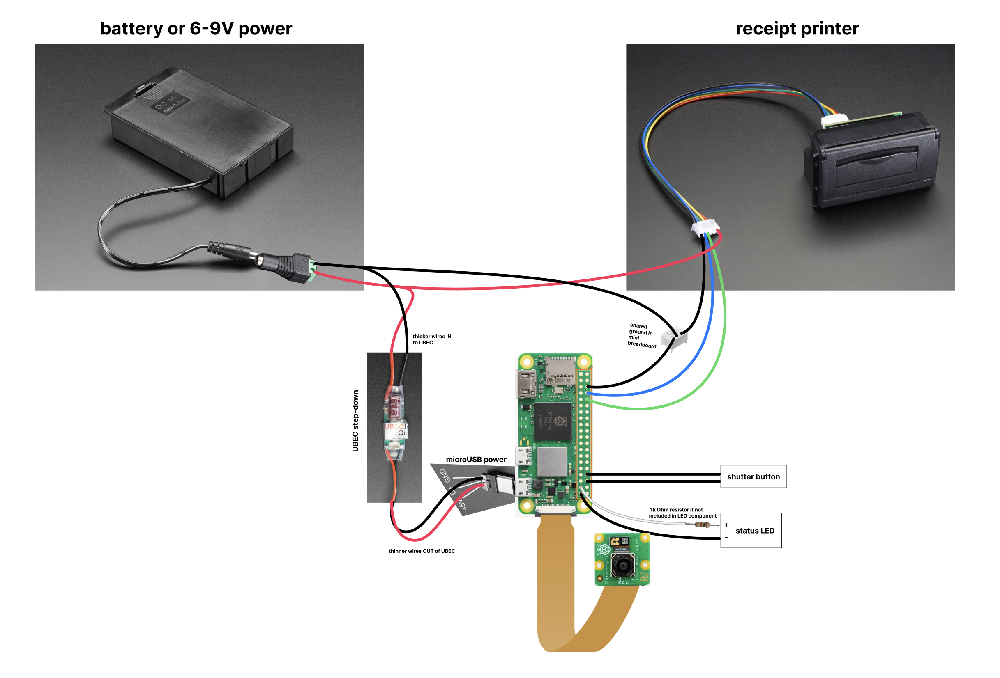

## Part 7: 이동 중 Wi‑Fi 네트워크 변경
이 카메라는 동작을 위해 Wi‑Fi가 필요합니다. `wpa_supplicant.conf`를 편집해 모바일 핫스팟을 하드코딩할 수도 있습니다. 이동 중 새 Wi‑Fi에 손쉽게 연결하려면 플러그 앤드 플레이 코드가 포함된 [이 간단한 튜토리얼](https://www.raspberrypi.com/tutorials/host-a-hotel-wifi-hotspot/)을 따라 하세요. (튜토리얼의 Flask 앱과 우리의 메인 카메라 코드를 각각 cron 작업으로 함께 자동 실행할 수도 있습니다.)

위 튜토리얼을 진행하려면 microUSB 포트에 두 번째 Wi‑Fi 어댑터를 꽂아야 합니다. Linux/Raspberry Pi에서 곧바로 인식되는 플러그 앤드 플레이 어댑터를 추천합니다.

작동이 확인된 Wi‑Fi 어댑터 예시:
- [Pi Hut(영국)](https://thepihut.com/products/usb-wifi-adapter-for-the-raspberry-pi)
- [LOTEKOO, Amazon](https://www.amazon.com/dp/B06Y2HKT75)
- [Canakit, Amazon](https://www.amazon.com/dp/B00GFAN498)

MicroUSB→USB 어댑터:
- [Amazon](https://www.amazon.com/Ksmile%C2%AE-Female-Adapter-SamSung-tablets/dp/B01C6032G0)
- [초슬림, Adafruit](https://www.adafruit.com/product/2910)
